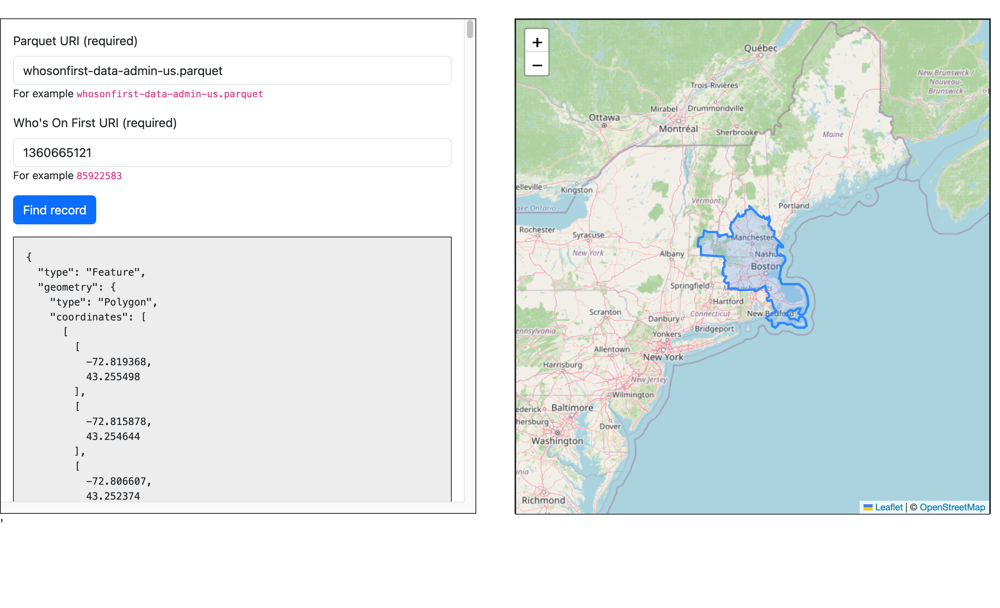

# www

Simple web application to test the `parquet_find_record.wasm` WebAssembly (WASM) binary.

## Example

Serve the `www` folder from any web server application or framework. For example:

```
$> fileserver -root parquet/www/
2026/09/10 17:10:54 Serving parquet/www/ and listening for requests on http://localhost:8080
```

I like to use the `fileserver` tool in [aaronland/go-http](https://github.com/aaronland/go-http) but you can use anything you prefer.

The web application will load the `parquet_find_record.wasm` binary and then allow you to specify a Parquet file to query over HTTP and a Who's On First URI to find in that Parquet file. For example:



## Important

Both parquet files (`*.parquet`) and WebAssembly files (`*.wasm`) are excluded from version control in this folder. They are just too big.

You can create Parquet files using the `wof-parquet-write` tool. For example:

```
$> ./bin/wof-parquet-write -writer-uri ./parquet/www/parquet/whosonfirst-data-admin-us /usr/local/data/whosonfirst-data/whosonfirst-data-admin-us/
2026/09/10 14:03:53 INFO Iterator stats elapsed=1m0.000308083s seen=49236 allocated="471 MB" "total allocated"="6.9 GB" sys="1.0 GB" numgc=125
...
2026/09/10 14:12:21 INFO Iterator stats elapsed=9m27.773626791s seen=448570 allocated="3.5 GB" "total allocated"="47 GB" sys="3.6 GB" numgc=184
```

You can create the `parquet_find_record.wasm` by running the handy `wasmjs-parquet` Makefile target (from the root of this repository). For example:

```
$> make wasmjs-parquet
GOOS=js GOARCH=wasm \
		go build -mod readonly -ldflags="-s -w" -tags wasmjs \
		-o parquet/www/wasm/parquet_find_record.wasm \
		cmd/wof-parquet-find-wasm/main.go
```		